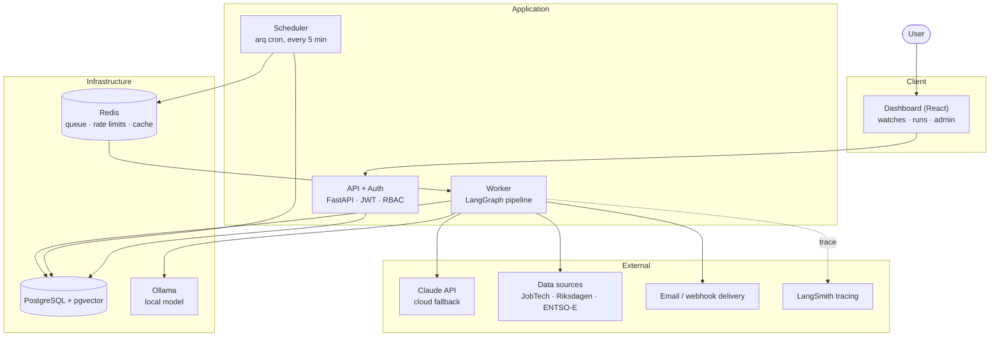
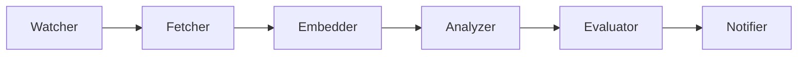

# PulseGraph

A multi-tenant agent-orchestration system that continuously watches open data
sources on behalf of each user, analyzes new content with a cost-aware hybrid of
local and cloud models, evaluates the quality of every analysis, and notifies
the user — instrumented end to end for traceability. A React dashboard covers
both the end-user flow (watches, runs, notifications) and an admin surface
(ops health, source health, review queue, users).

The design is documented as Architecture Decision Records in
[`docs/adr/`](docs/adr/) (22 ADRs), with the full system architecture in
[`docs/architecture.md`](docs/architecture.md) and the data model in
[`docs/data-model.md`](docs/data-model.md).

## Architecture



The frontend only ever talks to the API, which owns authentication and
authorization. The scheduler enqueues due watches onto Redis; a pool of arq
workers consumes the queue and runs the LangGraph pipeline below. See
[`docs/architecture.md`](docs/architecture.md) for the full pipeline graph,
the model-routing decision, and a cross-cutting-concerns table mapping every
ADR to where it lives in the code.

### Pipeline



Built on LangGraph (ADR 0001), with hybrid local/cloud model routing (ADR 0002),
a source-agnostic plugin pattern (ADR 0004), and eval as a first-class pipeline
step (ADR 0006).

## Running locally

PulseGraph is **local-first**: the default configuration runs the entire system
on your machine with no cloud dependencies and no API keys.

Requirements: Python 3.12+, [uv](https://github.com/astral-sh/uv), Node.js 20+,
Docker, and [Ollama](https://ollama.com) for the local model.

```bash
# 1. Start Postgres (pgvector) and Redis
docker compose up -d

# 2. Configure (the defaults are fully local)
cp .env.example .env

# 3. Install Python dependencies and apply migrations
uv sync --extra dev
uv run alembic upgrade head

# 4. Run the tests
uv run pytest

# 5. Run the API, scheduler + worker (separate terminals)
uv run uvicorn pulsegraph.api.app:app --reload
uv run arq pulsegraph.worker.arq_settings.WorkerSettings

# 6. Run the dashboard
cd dashboard && npm install && npm run dev
```

The dashboard dev server runs at `http://localhost:5173` and proxies `/api/*`
to the FastAPI app on `http://localhost:8000`. `uv run python src/pulsegraph/seed.py`
seeds demo/admin users, watches, and a week of runs for a populated dashboard.

The cloud model (Claude), LangSmith tracing, and email/webhook delivery are
opt-in via `.env` (`USE_CLOUD_MODEL`, `LANGSMITH_ENABLED`, `EMAIL_ENABLED`,
`WEBHOOK_ENABLED`); with the defaults the system never leaves your machine
except to fetch from the open data sources.

## Testing and quality gates

```bash
uv run pytest                              # unit + integration (FakeSession/offline adapters)
uv run ruff format --check . && uv run ruff check .
uv run python scripts/offline_eval.py      # release gate: golden-dataset eval (ADR 0012)
uv run python scripts/smoke_e2e.py         # e2e smoke against a real Postgres + Redis stack
```

CI (`.github/workflows/ci.yml`) runs the four checks above — lint, unit
tests, the offline eval gate, and the e2e smoke test against real
`pgvector` and `redis` service containers — plus a separate dashboard job
(`npm run lint` and `npm run build`, which itself runs `tsc -b`) — on
every push/PR to `master`.

To run the dashboard checks locally before pushing a frontend change:

```bash
cd dashboard && npm run lint && npm run build
```

## Deployment

A multi-stage [`Dockerfile`](Dockerfile) builds one image that serves every
runtime role — `api`, `worker`, or a one-shot `migrate` — selected by the
first argument. [`docker-compose.prod.yml`](docker-compose.prod.yml)
reproduces the full production stack (migrate → api + worker over managed
Postgres + Redis) locally:

```bash
cp .env.prod.example .env.prod          # set POSTGRES_PASSWORD + a strong JWT_SECRET_KEY
docker-compose --env-file .env.prod -f docker-compose.prod.yml up --build
```

CD (`.github/workflows/deploy.yml`) chains after a green CI run on `master`:
it builds and pushes the image, applies Alembic migrations, and deploys —
**staging automatically, production on an environment-gated manual promotion**.
The host rollout is a single platform-agnostic seam
([`scripts/deploy_release.sh`](scripts/deploy_release.sh)) you wire to your
platform, gated so the pipeline is a safe no-op until configured. The full
runbook — environments, secrets, migration rollback path, health probes — is
in [`docs/deployment.md`](docs/deployment.md).

For a full dry run with no cloud and no secrets, the **offline deploy lab**
([`scripts/lab_deploy.sh`](scripts/lab_deploy.sh)) exercises the whole release
loop — build → push to a local registry → migrate → roll api + worker → rollback
→ schema downgrade — against a Docker registry on `:5000` standing in for GHCR.
It layers [`docker-compose.lab.yml`](docker-compose.lab.yml) on top of the prod
stack; see the "Offline lab" section of
[`docs/deployment.md`](docs/deployment.md).

## Project layout

```
src/pulsegraph/
  config.py          Settings and local-first toggles
  domain/             Enumerations and shared types
  db/                 SQLAlchemy models (the data model)
  sources/            Source-agnostic Fetcher plugins (ADR 0004): JobTech, Riksdagen, ENTSO-E
  pipeline/           LangGraph pipeline: dedup, routing, sanitize, delivery
  api/                FastAPI app: auth, watches/runs/notifications, admin, health
  worker/             arq scheduler, worker tasks, persistence, retention, alerts
  eval/               Golden datasets + offline eval harness (ADR 0012)
  redis_client.py     Rate limiting, fetch cache, cost counter (ADR 0022)
  observability.py    LangSmith tracing setup (ADR 0007)
  seed.py             Demo data seeding for local dev

dashboard/            React + Vite + TypeScript frontend (end-user + admin UI)
migrations/           Alembic migrations
scripts/              Offline eval CLI, golden-dataset growth, e2e smoke, GDPR cascade check, deploy seam, offline deploy lab
docs/                 ADRs, architecture, data model, deployment runbook

Dockerfile            Multi-stage build; one image, three roles (api/worker/migrate)
docker/entrypoint.sh  Role dispatch for the image
docker-compose.yml    Local dev infra (Postgres + Redis)
docker-compose.prod.yml  Production-like full stack (all roles + datastores)
docker-compose.lab.yml   Offline deploy lab: source images from a local registry
.github/workflows/    CI (lint/test/eval/build/e2e) and CD (build/migrate/deploy)
```

Python tests are colocated next to the code they cover as `<module>_test.py`.
