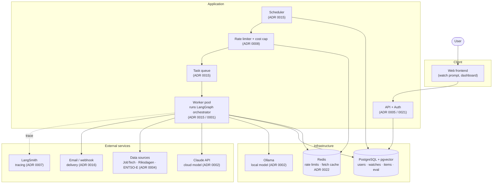
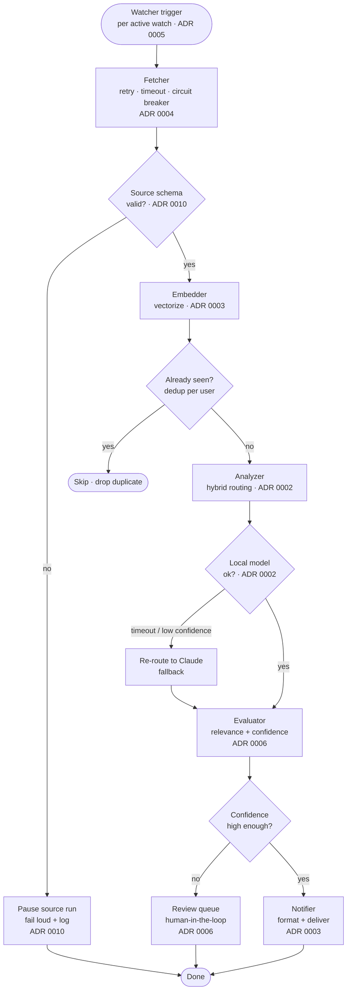
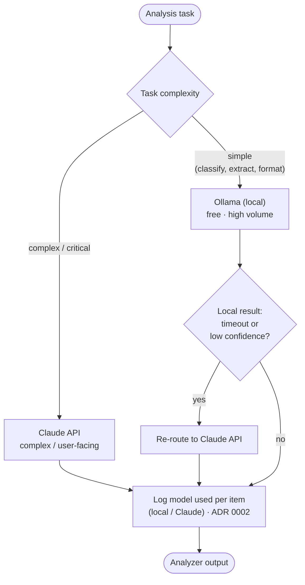

# PulseGraph — Architecture

PulseGraph is a multi-tenant agent-orchestration system that continuously
watches open data sources on behalf of each user, analyzes new content with a
cost-aware hybrid of local and cloud models, evaluates the quality of every
analysis, and notifies the user — all instrumented end to end for traceability.

This document is the visual companion to the Architecture Decision Records in
[`docs/adr/`](adr/). Every diagram below maps back to one or more ADRs; the
relevant ADR is cited inline.

---

## 1. System context

How the pieces fit together: the user-facing app, the orchestration core, the
shared infrastructure, and the external services the system depends on.

**Reading the diagram.** The frontend only ever talks to the API, which owns
authentication and authorization (ADR 0005 / 0021). The Scheduler picks up due
watches, checks per-user rate limits and the cost cap (ADR 0008), and enqueues
work; a pool of workers consumes the queue and runs the LangGraph pipeline (ADR
0015). A worker is the only component that reaches out to models, data sources,
and delivery channels, which keeps secrets and routing logic in one place (ADR
0009). LangSmith is a side-channel — tracing never sits on the critical path.

---

## 2. Agent pipeline (LangGraph)

The core is a six-stage directed graph with explicit conditional edges. Each
stage is an independently checkpointable, traceable node (ADR 0003). The
conditional branches are where the production patterns live: schema-drift
stop, dedup skip, model fallback, and the human-in-the-loop review queue.

**Why each branch exists.**

- **Schema gate (ADR 0010).** When the Fetcher's schema validation fails it
  stops *that source's* run explicitly, logs to the dashboard source log, and
  marks the source paused in `source_health`. The Watcher then skips triggering
  that source until it recovers, so a drifting source costs nothing meanwhile.
  Other sources and other users are unaffected — drift is isolated, never silent.
- **Dedup (ADR 0003).** The Embedder drops content already seen by this user so
  the same job ad or motion is never analyzed (or billed) twice.
- **Model fallback (ADR 0002).** The Analyzer starts on the local Ollama model;
  a timeout or low local-confidence re-routes the task to Claude rather than
  failing. The routing decision is logged per item for transparency.
- **Review queue (ADR 0006).** Low Evaluator confidence sends the item to a
  human-review queue instead of auto-notifying — the system does not blindly
  trust itself. Each human verdict is persisted as ground truth for the eval
  flywheel (ADR 0012).
- **Untrusted input (ADR 0013).** Source content reaches the Analyzer and
  Evaluator as clearly delimited, sanitized *data*, never as instructions, and
  both stages must return schema-validated output — so a crafted job ad cannot
  hijack the prompt.
- **Delivery fan-out (ADR 0016).** The Notifier delivers to the user's chosen
  channels (dashboard, email, webhook), batching low-urgency results into a
  digest and deduplicating so the same result is never delivered twice.

Every edge is a LangGraph transition with its own state, so each transition is a
checkpoint that LangSmith can replay for time-travel debugging (ADR 0007).
Workers run these graphs idempotently — at most one in-flight run per watch (ADR
0015).

---

## 3. Model routing decision (ADR 0002)

The Analyzer's internal decision, isolated so the cost-optimization logic is
explicit. The same low-confidence signal that triggers fallback here can also
feed the Evaluator's grading in stage 5.

Cost is bounded from two sides: routing keeps most volume on the free local
model, and a global cost cap pauses cloud calls before the monthly budget
(~5–10 USD) is breached (ADR 0008).

---

## 4. Cross-cutting concerns

| Concern | Where it lives | ADR |
|---|---|---|
| Authentication, roles & per-user data scoping | API layer + row-level scoping in DB | 0005 / 0021 |
| Rate limiting & cost caps | Limiter + Redis counters (INCR/EXPIRE per user-hour) | 0008 / 0022 |
| Secrets (API keys) | Env vars locally, platform secret manager in prod | 0009 |
| Observability & time-travel debugging | LangSmith trace per run, linked from dashboard | 0007 |
| Quality evaluation | Evaluator stage + aggregated system-health metric | 0006 |
| Source extensibility | Plugin per source behind a shared interface | 0004 |
| Reproducibility | Versioned prompts + pinned model/params per analysis | 0011 |
| Offline eval & feedback flywheel | Golden datasets + CI gate, grown from review verdicts | 0012 |
| LLM input hardening | Instruction/data separation + structured output | 0013 |
| Embedding version safety | `embedding_model` per vector + re-embed migration | 0014 |
| Scheduling & idempotent execution | Scheduler + queue + worker pool, one run per watch | 0015 |
| Notification delivery | Multi-channel + digest + dedup behind a channel interface | 0016 |
| Deployment & CI/CD | Managed hosting, Alembic migrations, gated pipeline | 0017 |
| Data retention & GDPR | Per-table retention job + erasure/export flows | 0018 |
| Testing | Unit + source-plugin contract + integration + eval tests | 0019 |
| Operational health & alerting | Health endpoints + infra metrics + operator alerts | 0020 |
| Audit logging | Security-relevant user/account actions recorded | 0021 |

---

## 5. Data model

The persistence design — tables, relationships, and how they back the pipeline
above — is documented separately in [`docs/data-model.md`](data-model.md).
