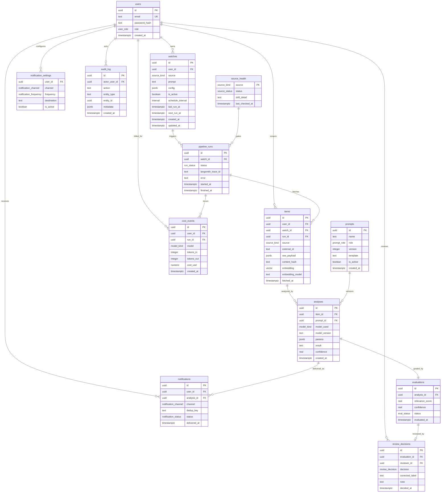

# PulseGraph — Data Model

The persistence layer is **PostgreSQL with the `pgvector` extension**: a single
production-grade store that holds relational data *and* embeddings, which keeps
the stack small and the budget low (ADR 0002, ADR 0008). Every row that belongs
to a user carries a `user_id` so the application can enforce row-level scoping
(ADR 0005) — one user can never read another's watches, items, or results.

This model backs the pipeline in [`docs/architecture.md`](architecture.md); each
table is annotated with the stage and ADR it serves.

---

## 1. Entity-relationship diagram



---

## 2. Table reference

| Table | Purpose | Pipeline stage / ADR |
|---|---|---|
| `users` | Account, credentials, and role; the tenant boundary. | Auth · ADR 0005/0021 |
| `watches` | A user's standing query against one source (the frontend prompt) plus its schedule. | Watcher · ADR 0005/0015 |
| `source_health` | Global per-source drift state: read by the Watcher to gate triggering, written by the Fetcher on schema drift. | Watcher + Fetcher · ADR 0010 |
| `pipeline_runs` | One execution of the graph for one watch; the join point to the LangSmith trace. | Orchestrator · ADR 0007/0015 |
| `prompts` | Versioned prompt registry; one active version per name/role. | Analyzer + Evaluator · ADR 0011 |
| `items` | A fetched unit of content, its raw payload, dedup hash, and embedding (with the model that produced it). | Fetcher + Embedder · ADR 0003/0004/0014 |
| `analyses` | The Analyzer's output plus the exact prompt, model, version, and params that produced it. | Analyzer · ADR 0002/0011 |
| `evaluations` | The Evaluator's relevance/confidence grade and pass/review verdict. | Evaluator · ADR 0006 |
| `review_decisions` | The human verdict on a review-queue item — ground truth for the eval flywheel. | Review · ADR 0012 |
| `notifications` | What was delivered, through which channel, with a dedup key to prevent repeats. | Notifier · ADR 0003/0016 |
| `notification_settings` | Per-user, per-channel delivery preferences (instant vs. digest, destination). | Notifier · ADR 0016 |
| `cost_events` | Per-call token + cost ledger; sums to the global cost cap. Run-rate counters live in Redis (see ADR 0022). | Limiter · ADR 0008/0022 |
| `audit_log` | Security-relevant user/account actions, for a forensic trail. | Auth/Admin · ADR 0021 |

### Design notes

- **Dedup is per user, not per watch (ADR 0003).** `items` carries both
  `user_id` and `content_hash` with a unique constraint on the pair, so the same
  job ad seen through two of a user's watches is stored once.
- **Drift is per source, not per user (ADR 0010).** When JobTech changes its
  schema it affects every JobTech watch, so the pause flag lives in
  `source_health` keyed by source — one row flips, all affected runs gate off,
  other sources keep running. The two stages play different roles against this
  table: the **Fetcher** *writes* the `paused` flag when its response-schema
  validation fails, and the **Watcher** *reads* it and skips triggering a paused
  source — so a drifting source costs nothing until its schema recovers or its
  plugin is updated.
- **One evaluation per analysis (`||--||`).** Re-analysis creates a new
  `analyses` row (and a new `evaluations` row), preserving history rather than
  mutating in place — which is what makes time-travel debugging meaningful.
- **Reproducibility is recorded, not inferred (ADR 0011).** `analyses` pins the
  `prompt_id` (into the versioned `prompts` registry), the `model_used` class,
  the exact `model_version`, and the `params` (temperature/top_p/seed). Any
  result can be reproduced and any eval regression attributed to a cause.
- **The feedback flywheel is persisted (ADR 0012).** Each review-queue verdict is
  stored in `review_decisions` (with an optional `corrected_label`). These rows
  seed the golden datasets and let confidence thresholds (ADR 0002/0006) be tuned
  empirically instead of guessed.
- **Embedding comparisons are version-safe (ADR 0014).** `items.embedding_model`
  records which model produced each vector; dedup/similarity only compares
  vectors from the same model, and a model change is an explicit re-embed
  migration rather than a silent break.
- **Scheduling is idempotent (ADR 0015).** `watches.next_run_at` drives the
  scheduler; a partial unique index allows **at most one** `pipeline_runs` row
  per watch in the `running` state, so a watch is never processed twice
  concurrently.
- **Alerts are deduplicated (ADR 0016).** `notifications.dedup_key` is unique per
  user, so the same result is never delivered twice even across channels.
- **Routing and cost stay observable.** `analyses.model_used`/`model_version`
  record local vs. Claude per item (ADR 0002); `cost_events` records the spend
  behind it (ADR 0008). Both surface in the dashboard source log.

---

## 3. Schema (PostgreSQL DDL)

Reference DDL. The migration tool (Alembic, ADR 0017) will own the canonical
version once the repo is scaffolded; this is the shape it should produce.

```sql
CREATE EXTENSION IF NOT EXISTS vector;

CREATE TYPE source_kind            AS ENUM ('jobtech', 'riksdagen', 'entsoe');
CREATE TYPE source_status          AS ENUM ('healthy', 'paused');
CREATE TYPE run_status             AS ENUM ('running', 'succeeded', 'failed', 'paused');
CREATE TYPE model_kind             AS ENUM ('ollama', 'claude');
CREATE TYPE eval_status            AS ENUM ('approved', 'review');
CREATE TYPE notification_status    AS ENUM ('pending', 'sent', 'failed');
CREATE TYPE user_role              AS ENUM ('user', 'admin');
CREATE TYPE prompt_role            AS ENUM ('analyzer', 'evaluator');
CREATE TYPE review_decision        AS ENUM ('approved', 'rejected', 'corrected');
CREATE TYPE notification_channel   AS ENUM ('dashboard', 'email', 'webhook');
CREATE TYPE notification_frequency AS ENUM ('instant', 'daily_digest');

CREATE TABLE users (
    id            uuid PRIMARY KEY DEFAULT gen_random_uuid(),
    email         text NOT NULL UNIQUE,
    password_hash text NOT NULL,
    role          user_role NOT NULL DEFAULT 'user',
    created_at    timestamptz NOT NULL DEFAULT now()
);

CREATE TABLE watches (
    id                uuid PRIMARY KEY DEFAULT gen_random_uuid(),
    user_id           uuid NOT NULL REFERENCES users(id) ON DELETE CASCADE,
    source            source_kind NOT NULL,
    prompt            text NOT NULL,
    config            jsonb NOT NULL DEFAULT '{}'::jsonb,
    is_active         boolean NOT NULL DEFAULT true,
    schedule_interval interval NOT NULL DEFAULT '1 hour',
    last_run_at       timestamptz,
    next_run_at       timestamptz NOT NULL DEFAULT now(),
    created_at        timestamptz NOT NULL DEFAULT now(),
    updated_at        timestamptz NOT NULL DEFAULT now()
);
CREATE INDEX idx_watches_user_active ON watches(user_id) WHERE is_active;
CREATE INDEX idx_watches_due ON watches(next_run_at) WHERE is_active;

CREATE TABLE source_health (
    source          source_kind PRIMARY KEY,
    status          source_status NOT NULL DEFAULT 'healthy',
    drift_detail    text,
    last_checked_at timestamptz NOT NULL DEFAULT now()
);

CREATE TABLE pipeline_runs (
    id                 uuid PRIMARY KEY DEFAULT gen_random_uuid(),
    watch_id           uuid NOT NULL REFERENCES watches(id) ON DELETE CASCADE,
    status             run_status NOT NULL DEFAULT 'running',
    langsmith_trace_id text,
    error              text,
    started_at         timestamptz NOT NULL DEFAULT now(),
    finished_at        timestamptz
);
CREATE INDEX idx_runs_watch ON pipeline_runs(watch_id, started_at DESC);
-- Idempotency: at most one in-flight run per watch (ADR 0015).
CREATE UNIQUE INDEX idx_runs_one_active ON pipeline_runs(watch_id) WHERE status = 'running';

CREATE TABLE prompts (
    id         uuid PRIMARY KEY DEFAULT gen_random_uuid(),
    name       text NOT NULL,
    role       prompt_role NOT NULL,
    version    integer NOT NULL,
    template   text NOT NULL,
    is_active  boolean NOT NULL DEFAULT false,
    created_at timestamptz NOT NULL DEFAULT now(),
    UNIQUE (name, version)
);
-- At most one active version per prompt name (ADR 0011).
CREATE UNIQUE INDEX idx_prompts_one_active ON prompts(name) WHERE is_active;

CREATE TABLE items (
    id              uuid PRIMARY KEY DEFAULT gen_random_uuid(),
    user_id         uuid NOT NULL REFERENCES users(id) ON DELETE CASCADE,
    watch_id        uuid NOT NULL REFERENCES watches(id) ON DELETE CASCADE,
    run_id          uuid REFERENCES pipeline_runs(id) ON DELETE SET NULL,
    source          source_kind NOT NULL,
    external_id     text,
    raw_payload     jsonb NOT NULL,
    content_hash    text NOT NULL,
    embedding       vector(768),
    embedding_model text,
    fetched_at      timestamptz NOT NULL DEFAULT now(),
    UNIQUE (user_id, content_hash)
);
CREATE INDEX idx_items_watch ON items(watch_id, fetched_at DESC);

CREATE TABLE analyses (
    id            uuid PRIMARY KEY DEFAULT gen_random_uuid(),
    item_id       uuid NOT NULL REFERENCES items(id) ON DELETE CASCADE,
    prompt_id     uuid REFERENCES prompts(id) ON DELETE SET NULL,
    model_used    model_kind NOT NULL,
    model_version text NOT NULL,
    params        jsonb NOT NULL DEFAULT '{}'::jsonb,
    result        text NOT NULL,
    confidence    real NOT NULL,
    created_at    timestamptz NOT NULL DEFAULT now()
);
CREATE INDEX idx_analyses_item ON analyses(item_id);

CREATE TABLE evaluations (
    id              uuid PRIMARY KEY DEFAULT gen_random_uuid(),
    analysis_id     uuid NOT NULL UNIQUE REFERENCES analyses(id) ON DELETE CASCADE,
    relevance_score real NOT NULL,
    confidence      real NOT NULL,
    status          eval_status NOT NULL,
    evaluated_at    timestamptz NOT NULL DEFAULT now()
);

CREATE TABLE review_decisions (
    id              uuid PRIMARY KEY DEFAULT gen_random_uuid(),
    evaluation_id   uuid NOT NULL UNIQUE REFERENCES evaluations(id) ON DELETE CASCADE,
    reviewer_id     uuid REFERENCES users(id) ON DELETE SET NULL,
    decision        review_decision NOT NULL,
    corrected_label text,
    note            text,
    decided_at      timestamptz NOT NULL DEFAULT now()
);

CREATE TABLE notifications (
    id           uuid PRIMARY KEY DEFAULT gen_random_uuid(),
    user_id      uuid NOT NULL REFERENCES users(id) ON DELETE CASCADE,
    analysis_id  uuid NOT NULL REFERENCES analyses(id) ON DELETE CASCADE,
    channel      notification_channel NOT NULL DEFAULT 'dashboard',
    dedup_key    text NOT NULL,
    status       notification_status NOT NULL DEFAULT 'pending',
    delivered_at timestamptz,
    UNIQUE (user_id, dedup_key)
);
CREATE INDEX idx_notifications_user ON notifications(user_id, delivered_at DESC);

CREATE TABLE notification_settings (
    user_id     uuid NOT NULL REFERENCES users(id) ON DELETE CASCADE,
    channel     notification_channel NOT NULL,
    frequency   notification_frequency NOT NULL DEFAULT 'instant',
    destination text,
    is_active   boolean NOT NULL DEFAULT true,
    PRIMARY KEY (user_id, channel)
);

-- Rate-limit counters (runs/hour per user) live in Redis, not SQL.
-- See ADR 0022: key pattern ratelimit:{user_id}:{window_epoch}, TTL 3600.
CREATE TABLE cost_events (
    id         uuid PRIMARY KEY DEFAULT gen_random_uuid(),
    user_id    uuid NOT NULL REFERENCES users(id) ON DELETE CASCADE,
    run_id     uuid REFERENCES pipeline_runs(id) ON DELETE SET NULL,
    model      model_kind NOT NULL,
    tokens_in  integer NOT NULL DEFAULT 0,
    tokens_out integer NOT NULL DEFAULT 0,
    cost_usd   numeric(10, 6) NOT NULL DEFAULT 0,
    created_at timestamptz NOT NULL DEFAULT now()
);
CREATE INDEX idx_cost_user_time ON cost_events(user_id, created_at DESC);

CREATE TABLE audit_log (
    id            uuid PRIMARY KEY DEFAULT gen_random_uuid(),
    actor_user_id uuid REFERENCES users(id) ON DELETE SET NULL,
    action        text NOT NULL,
    entity_type   text NOT NULL,
    entity_id     uuid,
    metadata      jsonb NOT NULL DEFAULT '{}'::jsonb,
    created_at    timestamptz NOT NULL DEFAULT now()
);
CREATE INDEX idx_audit_actor_time ON audit_log(actor_user_id, created_at DESC);
```

> **Note on `vector(768)`** — the dimension must match the embedding model
> recorded in `items.embedding_model` (768 is typical for local
> sentence-transformer models; adjust when the model is fixed). A model change to
> a different dimension is handled as the re-embed migration described in ADR
> 0014. Add an ANN index (HNSW/IVFFlat) once dedup query patterns are measured.
